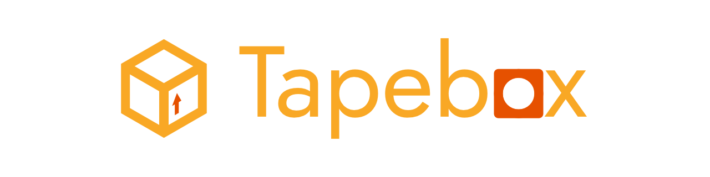
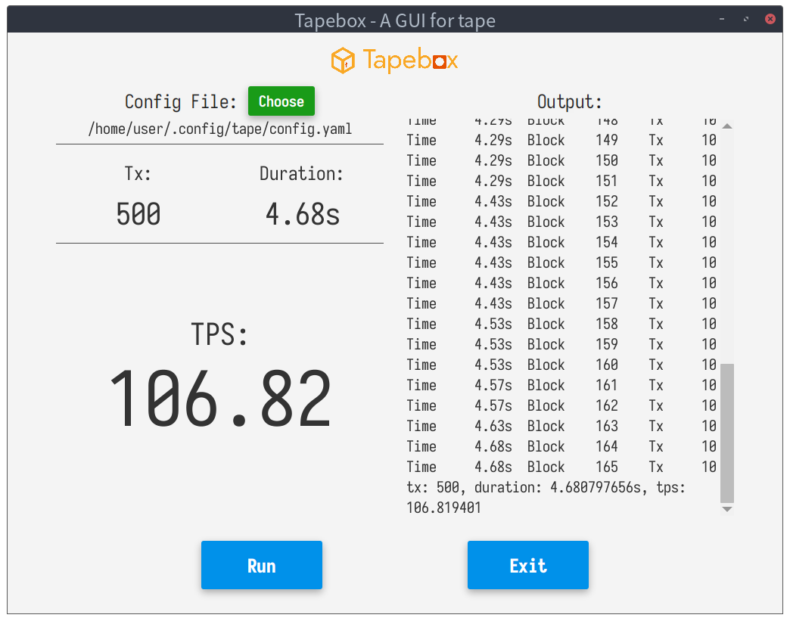

# tapebox



Tapebox - A GUI for [tape](https://github.com/guoger/tape)

## Build

* Build and install tape

  ```bash
  sudo apt install golang
  git clone https://github.com/guoger/tape.git && cd tape
  go build ./cmd/tape
  sudo mv ./tape /usr/local/bin
  cd ..
  ```

* Install Java 11 and Maven

  ```bash
  sudo apt install openjdk-11-jdk maven
  ```

* Clone this repository

  ```bash
  git clone https://github.com/zyw271828/tapebox.git && cd tapebox
  ```

* Maven run

  ```bash
  mvn javafx:run
  ```

## Screenshot

<p align="center"></p>

## License

Tapebox is licensed under the MIT License.
